<h1 style="font-size:36px;text-align:center;color:gray"> <b>Speech-To-Text</b> </h1>


<h1 style="color:green">Business/Real World Problem</h1>

<h2 style="color:blue">Description</h2>


<p style="color:gray;font-size:15px">Artificially intelligent machines are becoming smarter in every day. Deep learning and machine learning techniques enable machines to perform many tasks at the human level. In some cases, they even surpass human abilities. Machine intelligence can analyze big data faster and more accurately than a human possibly can. Even though they cannot think yet, they see, sometimes better than humans (read our computer vision and machine vision articles), they can speak, and they are also good listeners. Known as “automatic speech recognition” (ASR), “computer speech recognition”, or just “speech to text” (STT) enables computers to understand spoken human language.</p>

<p style="color:gray;font-size:15px"><b>Note:</b>Speech recognition and speaker recognition are different terms. While speech recognition is to understand what is told, speaker recognition is to know the speaker instead of understanding the context of the speech that can be used for security measures. These two terms are confusing and voice recognition is often used for both.</p> 


<h2 style="color:blue">Problem Statement</h2>
<p style="color:gray;font-size:15px">This is <b>END TO END</b> model, given audio data that convert Analog-to-Digital using (ADC) converter, then extract features form audio using some Signinal-Processing algorithms like Sort-Time-Fourier-Transform(STFT), Then using some Deep-Learning based techniques (like CNN's, LSTM's and GRU's) convert audio features into text representation</p>

<h2 style="color:blue">Source/Useful Links</h2>

<p style="color:gray;font-size:15px"> Some articles and reference blogs about ths problem statement</p>

<p style="color:gray;font-size:16px"> We are referred to some research papers and open source projects/repositories maintained below </p>

<h3 style="color:red">Research Papers</h3>

<ul style="color:gray">
  <li><a href="https://arxiv.org/pdf/1512.02595.pdf">Deep Speech 2: End-to-End Speech Recognition in
English and Mandarin</a></li>
  <li><a href="https://arxiv.org/pdf/1904.03288.pdf">Jasper: An End-to-End Convolutional Neural Acoustic Model</a></li>
  <li><a href="https://arxiv.org/pdf/1508.01211.pdf">Listen,Attend and Spell</a></li>
</ul>

<h3 style="color:red">Open Source Projects</h3>

<ul style="color:gray">
  <li><a href="https://arxiv.org/pdf/1512.02595.pdfhttps://github.com/SeanNaren/deepspeech.pytorch">deepspeech.pytorch</a></li>
  <li><a href="https://github.com/NVIDIA/OpenSeq2Seq/tree/master/open_seq2seq">NVIDIA OpenSeq2Seq</a></li>
  <li><a href="https://github.com/foamliu/Listen-Attend-Spell-v2">Listen,Attend and Spell</a></li>
</ul>


<h2 style="color:blue">Objective</h2>

<p style="color:gray;font-size:16px">Our objective is to build End-To-End Speech Recognition System using existing research and Try verious architectures, Then find out which one works better for us.</p>


<h2 style="color:blue">Constrains</h2>

<ul style="color:gray">
    <li><b style="color:red">Latency:</b> Given a audio (.wav) file the model predict Text what's spoken in that audio file, depending on application what you are using latency important</li>
    <li><b style="color:red">Interpretability:</b> As long as the speaker has spoken he/she wanted to check what are they spoken, they don't what to know how the model predicting that, so in this case, interpretability not importent.</li>
  <li><b style="color:red">Word Error Rate: </b> Word error rate (WER) is a common metric of the performance of a speech recognition or machine translation system. The general difficulty of measuring performance lies in the fact that the recognized word sequence can have a different length from the reference word sequence (supposedly the correct one).</li></ul>

<p><b style="color:green"> Our goal is to train best model that gives low Word Error Rate(WER) </b></p>

<h1 style="color:green">2. Machine Learning Problem Formaulation</h1>

<h2 style="color:blue">2.1 Data Collection</h2>


<p style="color:gray;font-size:15px">We want to use some open-source datasets, that are available online</p>

<ul style="color:gray">
    <li><b><a href="https://www2.imda.gov.sg/NationalSpeechCorpus">National Speech Corpus:</a></b><p1> Contains 2000 hours of locally accented audio and text transcriptions</p1></li>
 <li><b><a href="https://wordnet.princeton.edu/download">LibriSpeech:</a></b><p1> Dataset consists of a large-scale corpus of around 1000 hours of English speech</p1></li>
<li><b><a href="https://code.google.com/archive/p/wiki-links/downloads">TIMIT:</a></b><p1>  A collection of recordings of 630 speakers of American English</p1></li>
<li><b><a href="https://psi.engr.tamu.edu/l2-arctic-corpus/">L2-ARCTIC:</a></b><p1>  A non-native English speech corpus
</p1></li>
</ul>

<h2 style="color:blue">2.2 Applications</h2>

<p style="color:gray;font-size:15px">Everybody know Siri, the smart assistant of iPhone users. Siri is the most common example of voice recognition application. The other assistants like Microsoft’s Cortana or Amazon’s Alexa are the best examples of voice recognition-powered programs. Or maybe some of you can recall Jarvis from Ironman.</p>

<p style="color:gray;font-size:15px">I guess many of you did use the Google’s voice to learn the true pronunciation of a word from Google translate. In that case, natural language processing is also used with voice recognition.</p>

<p style="color:gray;font-size:15px">YouTube also uses speech recognition to automatically generate subtitles for the videos. When you upload a video that includes speeches or talks, YouTube detects it and provide a transcription. You can also have the minute-by-minute text of the transcribed speech.</p>

<p style="color:gray;font-size:15px">There are many applications that voice recognition is implemented. Even in health care, voice recognition is used. Doctors can determine a person’s mental state whether he/she is depressed or suicidal by analyzing his/her voice.</p>

<ul style="color:gray">
  <li>Automatic subtitlingwith speech recognition (YouTube)</li>
  <li>Automatic translation</li>
  <li>Court reporting(Realtime Speech Writing)</li>
  <li>eDiscovery(Legal discovery)</li>
  <li>Hands-free computing: Speech recognition computer user interface</li>
  <li>Mobile telephony, including mobile email</li>
  <li>Interactive voice response</li>
</ul>

<h2 style="color:blue">2.3 Type of Machine Learning Problem</h2>

<p style="color:gray;font-size:15px">Given a Input sound wave through the model(neural network) one chunk at a time, we'll end up with a mapping of each audio chunk to the letters most likely spoken during that chunk. Here’s what that mapping looks like for me saying “Hello”</p>


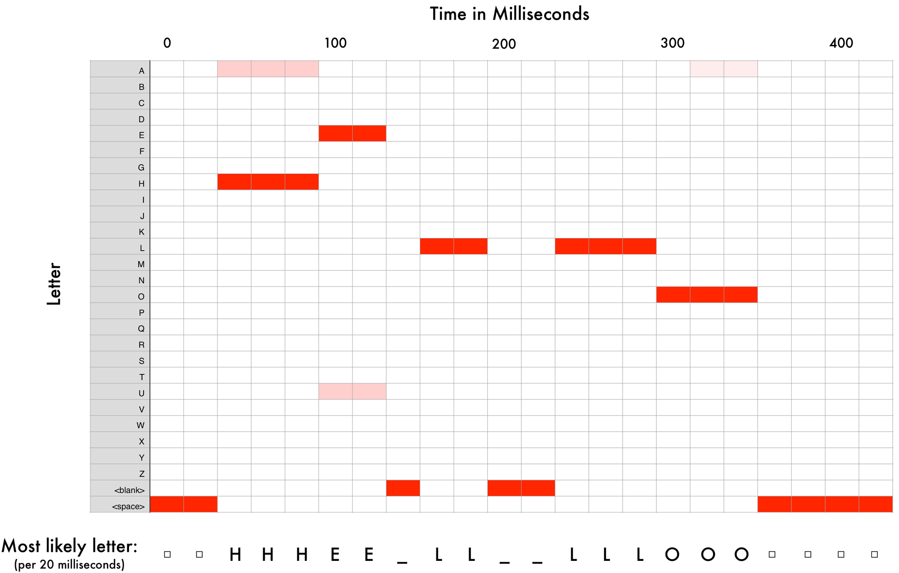


<h2 style="color:blue">2.4 Performance Matric</h2>

<p style="color:gray;font-size:15px">The standerd measurement to assess the performance of an speech recognition system is the so-called <b>Word Error Rate (WER).</b></p>

<ul style="color:gray">
    <li><b style="color:red">WER:</b>
        <p>source:<a>https://www.rev.ai/blog/how-to-calculate-word-error-rate/</a></p>
        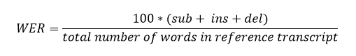<ul>
        <li><b>Substitutions</b> are anytime a word gets replaced (for example, “twinkle” is transcribed as “crinkle”)</li>
        <li><b>Insertions</b> are anytime a word gets added that wasn’t said (for example, “trailblazers” becomes “tray all blazers”)</li>
        <li><b>Deletions</b> are anytime a word is omitted from the transcript (for example, “get it done” becomes “get done”)</li>
        </ul>
    </li>
 </ul>
 
 <h1 style="color:green">3. Data Preparation</h1>
 
 <h2 style="color:blue">3.1 Data Folders</h2>

```
  data --> train --> wav --> 1.wav
                         --> 2.wav
                         --> .....
                         --> .....
                         --> lastid.wav
                 --> txt --> 1.txt
                         --> 2.txt
                         --> .....
                         --> .....
                         --> lastid.txt
       --> test  --> wav --> 1.wav
                         --> 2.wav
                         --> .....
                         --> .....
                         --> lastid.wav
                 --> txt --> 1.txt
                         --> 2.txt
                         --> .....
                         --> .....
                         --> lastid.txt
       --> val   --> wav --> 1.wav
                         --> 2.wav
                         --> .....
                         --> .....
                         --> lastid.wav
                 --> txt --> 1.txt
                         --> 2.txt
                         --> .....
                         --> .....
                         --> lastid.txt
       --> train_mainfile.csv
       --> text_mainfile.csv
       --> val_mainfile.csv
```

<p style="color:gray;font-size=15px">
    <p1>1. Create new folder called<code>data</code></p1><br>
    <p1>2. Create new folders <code>data/train, data/text, data/val</code></p1><br>
    <p1>3. Create new folders <code>data/train/wav, data/train/txt && data/test/wav, data/test/txt && data/val/wav, data/val/txt</code></p1><br>
    <p1>4. We are trying to put all traing .wav files in <code>data/train/wav</code> and all text files corresponding to .wav files put in <code>data/train/txt</code>, test and val also</p1>
    <p1>5. Then we create a <code>train_mainfile.csv, text_mainfile.csv, val_mainfile.csv</code> those contains all file paths of .wav and .txt corresponding folders.</p1><br>
    
    
</p>

<h2 style="color:blue">3.2 Downloading Data</h2>


<p style="color:gray;font-size=15px">
    <p1>1. Download LibriSpeech datasets <a href="http://www.openslr.org/resources/12/train-clean-360.tar.gz">train-clean-360.tar.gz</a>, <a href="http://www.openslr.org/resources/12/test-clean.tar.gz">test-clean.tar.gz</a> and <a href="http://www.openslr.org/resources/12/dev-clean.tar.gz">dev-clean.tar.gz</a> keep in <code>data</code> folder</p1><br>
    <p1>2. Then extract each file and move .wav files into corresponding files we are created</p1><br>
    <p1>3. The folders look like this</p1>
    
    
    
</p>

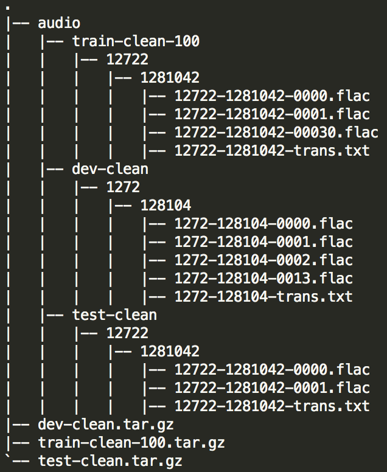

<h2 style="color:blue">3.3 Data Preparation</h2>

<p style="color:gray;font-size=15px">
   Know we extract all .wav and .txt files, move to correspoinding folders    
</p>

Then create `train_mainfile.csv` and `test_mainfile.csv` those contains information about `wav_paths` and `txt_paths` for train and test data.

Check the code in [Notebook](link)

<h1 style="color:green">4. Exploratory Data Analysis (EDA)</h1>

<h2 style="color:blue">4.1 Loading Data</h2>


<ul style="color:gray;font-size=15px">
    <li>1. Load <code>train_mainfile.csv</code></li>
    <li>2. for EDA we take sample of data </li> 
    
</ul>

<h2 style="color:blue">4.2 Data Exploration</h2>

<h3>4.2.1. Let's listen to .wav file</h3>

wav file : [1859-145701-0003.wav](https://github.com/Gopi-Durgaprasad/Speech-To-Text/blob/master/images/1859-145701-0003.wav)

Text : ```AND THE OLD KING FELL ON HER NECK AND KISSED HER BUT SHE WAS VERY MUCH TROUBLED AND SAID DEAR FATHER LISTEN TO WHAT HAS BEFALLEN ME I SHOULD NEVER HAVE COME HOME AGAIN OUT OF THE GREAT WILD WOOD IF I HAD NOT COME TO AN IRON STOVE```

Wav Plot :

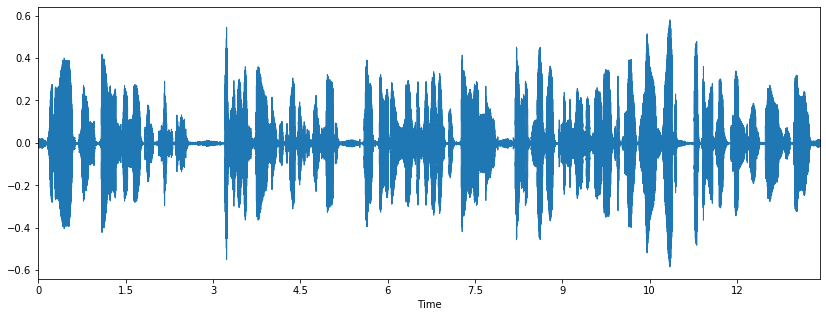

<h3>4.2.1. Cumulative Distribution Function (CDF) and (PDF) for duration</h3>

<p float="left">
  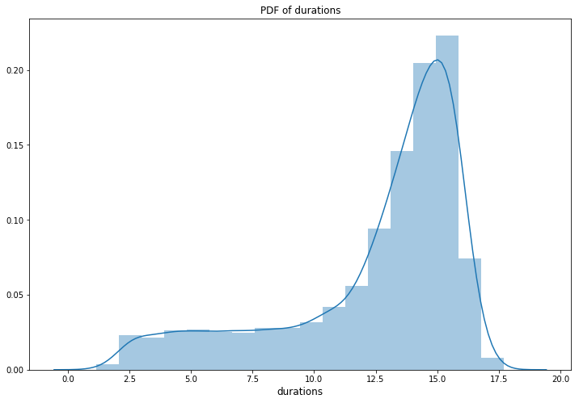
  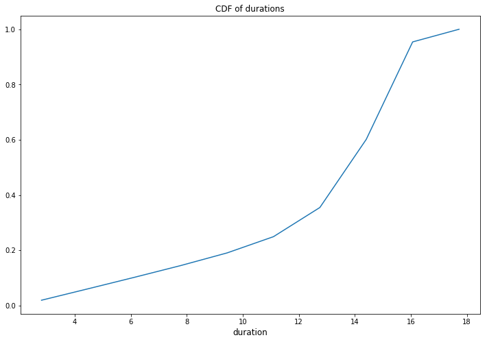
</p>

**Observation:** From above two plots we observe that most of durations in between 10sec to 16sec

<h2 style="color:blue">4.3 Text Data Exploration</h2>

<h3>4.3.1. Cumulative Distribution Function (CDF) and (PDF) for text_lengths</h3>

<p float="left">
  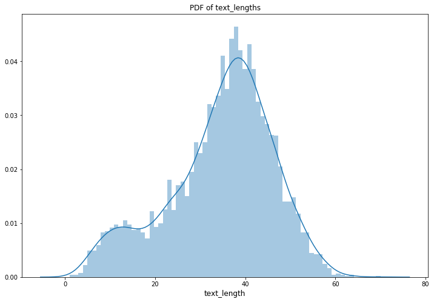
  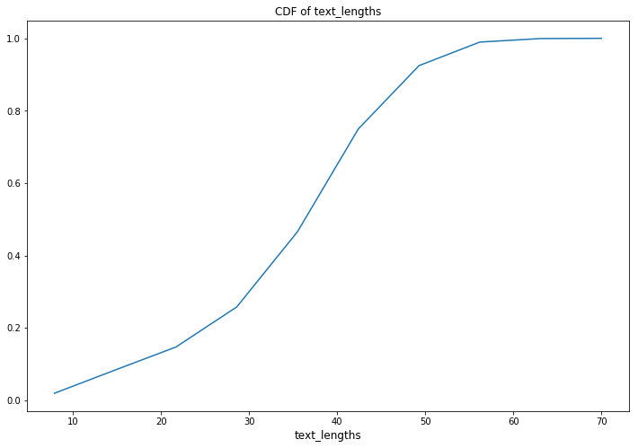
</p>

**Observation:** From above two plots we observe that most of text lengths in between 30 and 60

<h3>4.3.2. Distributions of text_length and duration</h3>

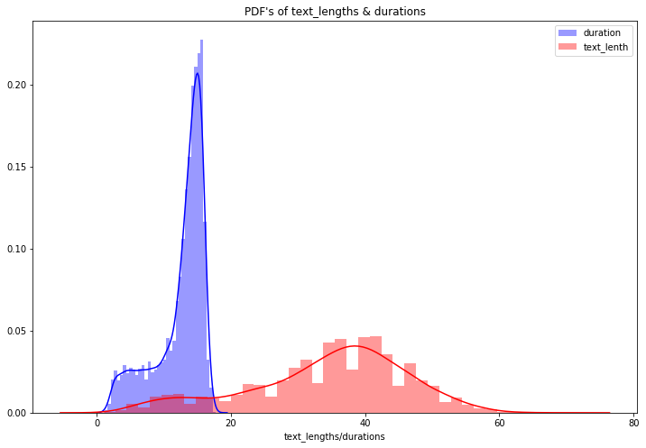

**Observation:** both are very different distributions

<h3>4.3.2. Count plot of Characters</h3>

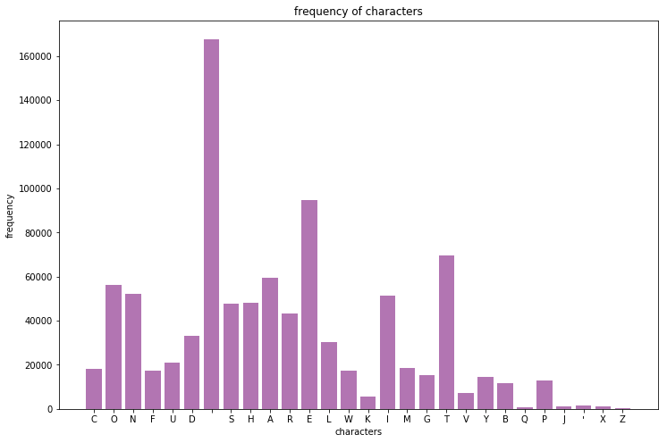

**Observation:** From above frequency the most frequecy characters are ' '(space), 'E', 'T' and the low frequency characters are 'Z', 'X', ''', 'J' , 'Q'

<h3>4.3.3. Frequency of words</h3>

Number of unique words :  16421

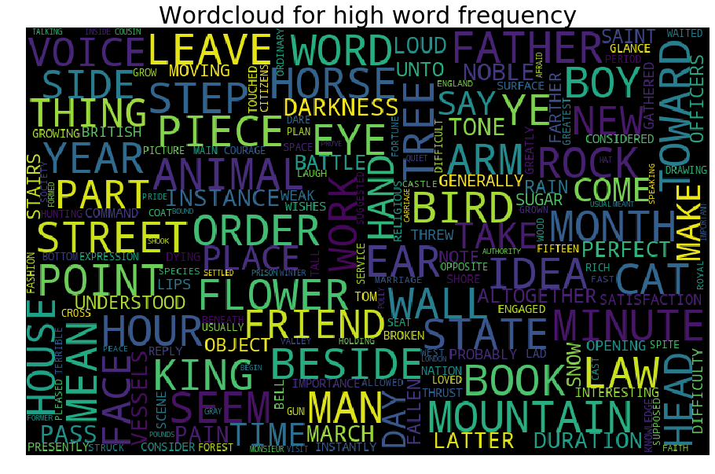
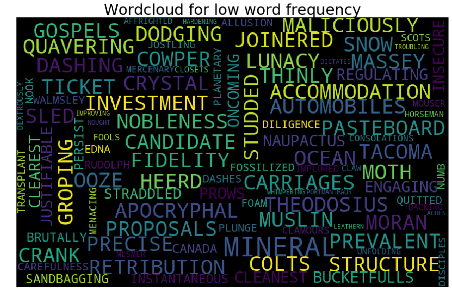

<h3>4.3.4. Cumulative Distribution Function (CDF) and (PDF) for word frequency</h3>

<p float="left">
  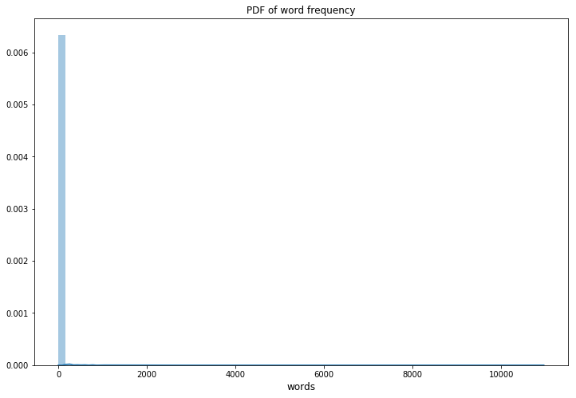
  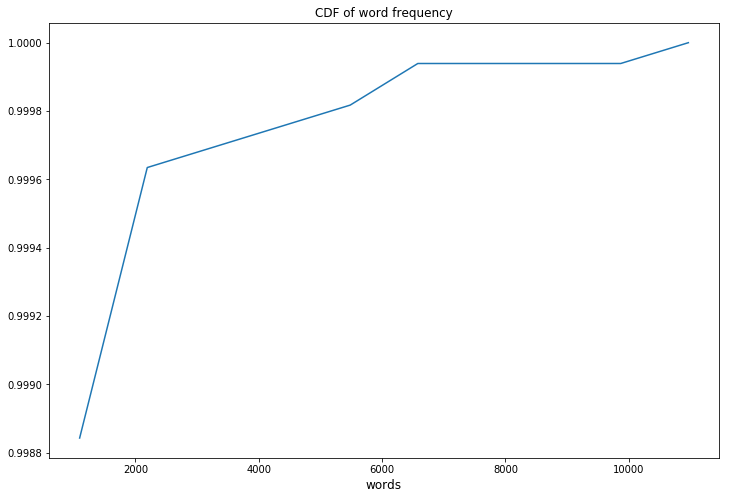
</p>

**Observation:** from the above plots we observe very few words have high frequency, most of words are low frequency

<h1 style="color:green">5.  Feature Extraction from Audio </h1>

<h2 style="color:blue">Description</h2>

- Extracting features from audio data, The most importent step in ML is extracting features from raw data.

- In this section we will see how to extract features from raw audio/speech
- 1. What is simple wave and how it look likes ?
- 2. What is complex wave and how it look likes ? 
- 3. What is audio/speech wave and how it look likes ?
- 4. Frequncy domine and time domine ?
- 5. converting time domine to frequency domine (fft fast foure trasfram)
- 6. What are the methodes to extract features from audio ?
- 7. Mel-Frequency Cepstral Coefficients (MFCC)

#### Check this notebook : <a href="https://github.com/Gopi-Durgaprasad/Speech-To-Text/blob/master/2.Extracting%20Features.ipynb">2.Extracting Features.ipynb</a>

<h1 style="color:green">6.  Modeling </h1>

- For model we are using deepspeech2 implementation

- For more details check this paper : <a href="https://arxiv.org/pdf/1512.02595.pdf">Deep Speech 2: End-to-End Speech Recognition in
English and Mandarin</a>

<h1 style="color:green">7. Training </h1>

Configuration is done in `config.py`.

Training command:
```
python main.py
```

| Dataset | WER | CER |
| :---: | :---: | :---: |
| Librispeech clean | 11.20 | 3.36 |

For more details check `main.py`

<h2 style="color:green"> Pre-traine Model </h2>

Download [hear](https://github.com/SeanNaren/deepspeech.pytorch/releases/download/v1.1/ted_pretrained.pth)


